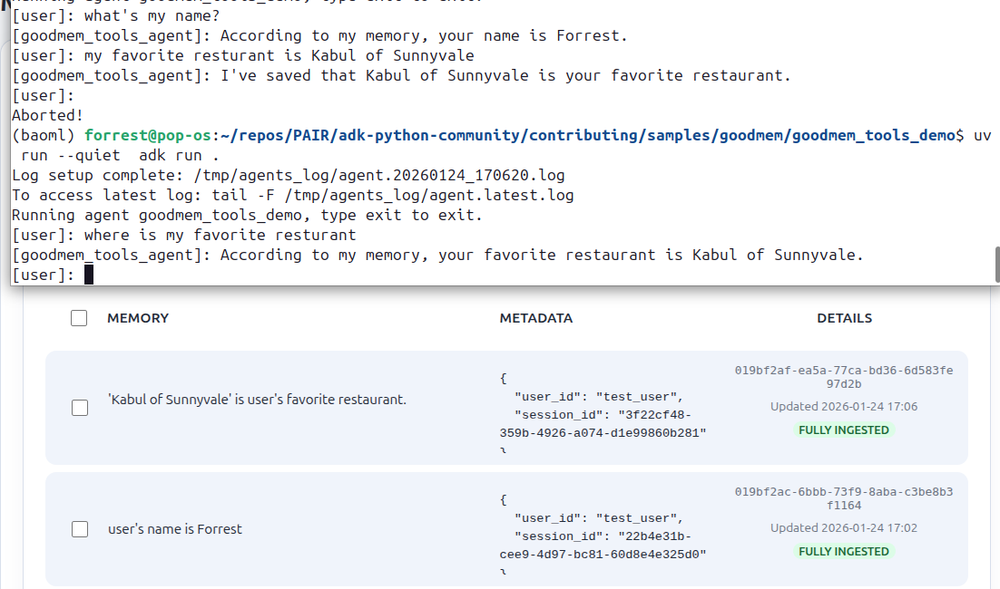

# Goodmem tools for ADK

The Goodmem tools (`goodmem_save` and `goodmem_fetch`) let an ADK agent store
and retrieve user-specific memories. The agent decides what to save and when
to recall it.




## Usage in an ADK agent

Preparation:

1. Install Goodmem (local or serverless) following the
   [quick start](https://goodmem.ai/quick-start).
2. Create **at least one embedder** in Goodmem.
3. Get your Goodmem configuration:
   - Base URL (e.g. `https://api.goodmem.ai`) without the `/v1` suffix
   - API key
   - Embedder ID (optional; if not provided, the tools use the first embedder)

Then add the tools to your agent as follows:

```python
# @file agent.py
import os
from google.adk.agents import LlmAgent
from google.adk.apps import App
from google.adk_community.tools.goodmem import GoodmemSaveTool
from google.adk_community.tools.goodmem import GoodmemFetchTool

goodmem_save_tool = GoodmemSaveTool(
    base_url="https://api.goodmem.ai",
    api_key="your-api-key-here",
    embedder_id="your-embedder-id",  # Optional, only needed if you wanna pin a specific embedder from multiple embedders
    debug=False,
)
goodmem_fetch_tool = GoodmemFetchTool(
    base_url="https://api.goodmem.ai",
    api_key="your-api-key-here",
    embedder_id="your-embedder-id",  # Optional, only needed if you wanna pin a specific embedder from multiple embedders
    top_k=5,  # Default number of memories to retrieve
    debug=False,
)

root_agent = LlmAgent(
    model='gemini-2.5-flash',
    name='goodmem_tools_agent',
    description='A helpful assistant for user questions.',
    instruction='Answer user questions to the best of your knowledge',
    tools=[goodmem_save_tool, goodmem_fetch_tool],
)

app = App(
    name='goodmem_tools_demo',
    root_agent=root_agent,
)
```

## Demo app in this repository

This repo includes a ready-to-run demo in `goodmem_tools_demo/` with an `agent.py`.

From the parent directory of `goodmem_tools_demo/`, run either of the two commands below:

```bash
adk run goodmem_tools_demo # terminal
# Or:
adk web . # web browser, then select the "goodmem_tools_demo" agent from the left panel
```

## Installation for local development

If you want to use these tools after changes not yet merged into an official `google-adk-community` release, install from this repository in editable mode:

```bash
# Clone the repository (or navigate to your local clone)
cd adk-python-community

# Install the package in editable/development mode
pip install -e ".[goodmem]"
```

This will make `from google.adk_community.tools import goodmem_save, goodmem_fetch`
available immediately, and changes you make locally will be picked up without
reinstalling.

## File structure

```text
adk-python-community/
├─ contributing/samples/goodmem/
│  ├─ TOOLS.md
│  ├─ goodmem_tools_for_adk.png
│  └─ goodmem_tools_demo/
│     └─ agent.py
├─ src/google/adk_community/tools/goodmem/
│  ├─ __init__.py
│  ├─ goodmem_client.py
│  └─ goodmem_tools.py
└─ tests/unittests/tools/
   └─ test_goodmem_tools.py
```

## Configuration parameters

### GoodmemSaveTool

- `base_url` (required): The base URL for the Goodmem API without the `/v1` suffix
  (e.g., `"https://api.goodmem.ai"`). The client appends `/v1` internally.
- `api_key` (required): The API key for authentication.
- `embedder_id` (optional): The embedder ID to use when creating new spaces.
  If not provided, uses the first available embedder.
- `debug` (optional): Enable debug logging (default: `False`).

### GoodmemFetchTool

- `base_url` (required): The base URL for the Goodmem API without the `/v1` suffix
  (e.g., `"https://api.goodmem.ai"`). The client appends `/v1` internally.
- `api_key` (required): The API key for authentication.
- `embedder_id` (optional): The embedder ID to use when creating new spaces.
  If not provided, uses the first available embedder.
- `top_k` (optional): Default number of memories to retrieve (default: `5`, max: `20`).
  Can be overridden per call.
- `debug` (optional): Enable debug logging (default: `False`).


## Troubleshooting

- **Base URL errors (404s like `/v1/v1/...`)**: make sure the `base_url` does not
  include `/v1`. The client appends `/v1` internally.
- **No embedders available**: create at least one embedder in Goodmem, or provide
  a valid `embedder_id` when initializing the tool.
- **Auth errors**: verify the `api_key` matches your Goodmem deployment.
- **Configuration errors**: ensure `base_url` and `api_key` are provided when
  initializing the tools.

## Design notes

- **user_id is never None**: ADK's `Session.user_id` is a required field enforced by Pydantic. Do not add defensive null-checks for `tool_context.user_id`.
- **Debug prints in binary uploads are intentional**: The data printed is already stored in Goodmem. Developers control both logs and database.
- **`_tool_debug` global flag**: This is low risk and only applies when debug mode is enabled. In normal deployments debug is off, so this does not apply.
- **Blocking HTTP in async functions**: The tools use synchronous `requests` in async functions. This matches ADK's own `RestApiTool` pattern.
- **NDJSON parsing**: Malformed lines are skipped gracefully for better UX.
