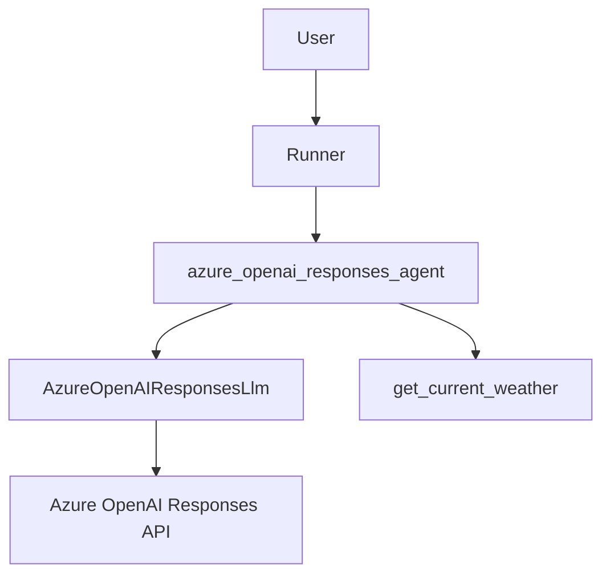

# Hello World with Azure OpenAI Responses

## Overview

This sample is a manual end-to-end test for the community Azure OpenAI
Responses API model client. It validates that ADK can run an agent with
`AzureOpenAIResponsesLlm`, execute a custom function tool, preserve multi-turn
context through the runner, and directly chain Responses API calls with
`previous_response_id`.

## Sample Inputs

- `Reply with exactly: AZURE_RESPONSES_TEXT_OK`

  Verifies basic text generation through `Runner.run_async`.

- `Use the weather tool for Tokyo and report the result.`

  Verifies Responses API function calling and function result handling.

- `What manual E2E code phrase did I ask you to remember?`

  Verifies multi-turn runner context after a previous turn stores the phrase
  `cobalt otter`.

- `Using the previous response context, what direct Responses code phrase did I ask you to remember?`

  Verifies direct model-level `previous_response_id` chaining after a prior
  Responses API call stores the phrase `amber swan`.

## Graph



## How To

Create a `.env` file in this directory or export the variables in your shell:

```bash
export AZURE_OPENAI_API_KEY="your-api-key"
export AZURE_OPENAI_ENDPOINT="https://your-resource.openai.azure.com"
export AZURE_OPENAI_RESPONSES_DEPLOYMENT="your-model-deployment"
```

Install this repository with the OpenAI extra before running the sample:

```bash
uv sync --extra openai
```

Run the manual E2E test from this sample directory:

```bash
cd contributing/samples/models/hello_world_azure_openai_responses
python main.py
```

The test prints the runner setup, tool calls, tool responses, interaction IDs,
and pass/fail status for each scenario.

Expected output shape:

```text
Azure OpenAI Responses manual E2E
Endpoint: https://your-resource.openai.azure.com
Deployment: your-model-deployment

========================================================================
TEST 1: Runner Basic Text Generation
========================================================================
>> User: Reply with exactly: AZURE_RESPONSES_TEXT_OK
<< Agent: AZURE_RESPONSES_TEXT_OK
PASSED: Runner basic text generation works

========================================================================
TEST 2: Runner Function Calling
========================================================================
>> User: Use the weather tool for Tokyo and report the result.
   [Tool Call] get_current_weather({'city': 'Tokyo'})
   [Tool Result] get_current_weather: {'city': 'Tokyo', ...}
<< Agent: Tokyo ... 68 ... Partly Cloudy
PASSED: Runner function calling works

========================================================================
TEST 3: Runner Multi-Turn Context
========================================================================
PASSED: Runner multi-turn context works

========================================================================
TEST 4: Direct Responses previous_response_id Chaining
========================================================================
   First response id: resp_...
<< Direct model: amber swan
   Second response id: resp_...
PASSED: Direct previous_response_id chaining works

========================================================================
ALL MANUAL E2E TESTS PASSED
```

## Manual E2E PR Evidence

For PR validation, include the exact command and relevant console output:

```bash
cd contributing/samples/models/hello_world_azure_openai_responses
python main.py
```

Highlight these log sections in the PR description:

- `TEST 1: Runner Basic Text Generation`
- `TEST 2: Runner Function Calling`, including `[Tool Call]` and `[Tool Result]`
- `TEST 3: Runner Multi-Turn Context`
- `TEST 4: Direct Responses previous_response_id Chaining`, including response IDs
- `ALL MANUAL E2E TESTS PASSED`

## Code Structure

```text
hello_world_azure_openai_responses/
├── __init__.py
├── agent.py
├── main.py
└── README.md
```

## Notes

- This is a manual E2E sample and requires a live Azure OpenAI deployment that
  supports the Responses API.
- `AZURE_OPENAI_RESPONSES_DEPLOYMENT` must be the Azure deployment name, not
  necessarily the base model name.
- The sample sets `store=True` on `AzureOpenAIResponsesLlm` so the direct
  `previous_response_id` check can chain server-side Responses API state.
